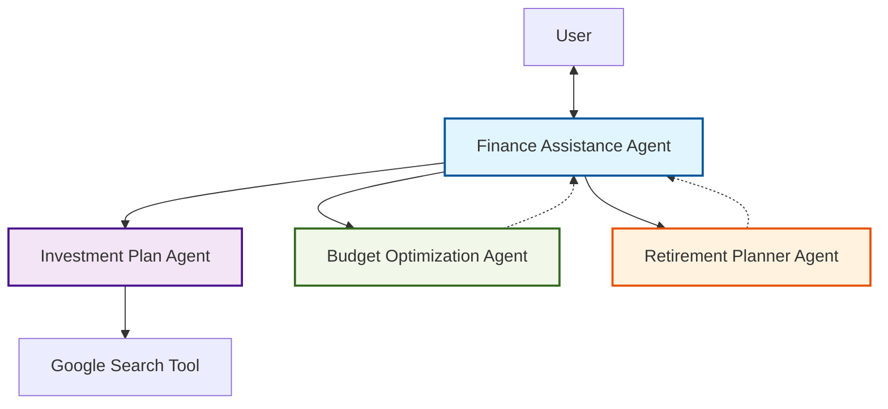

# ADK Finance Assistance Agent

An intelligent finance assistant built using the Google Agent Development Kit (ADK) and Gemini models. This agent helps users with personal finance management, investment research, budgeting, and retirement planning.

## Features

- **Personal Finance Assistant**: The main interface for conversational finance advice.
- **Investment Plan Agent**: Researches stock prices, market news, and financial data using Google Search.
- **Budget Optimization Agent**: Analyzes expenses and suggests cost-cutting strategies (e.g., 50/30/20 rule).
- **Retirement Planner Agent**: Helps users estimate retirement corpus limits and plan for the long term.

## Architecture




## Project Structure

- `finance_assistance_agent/`: Main agent logic and orchestration.
- `investment_plan_agent/`: specialized agent for market data and investment research.
- `budget_optimization_agent/`: Specialized agent for budgeting advice.
- `retirement_planner_agent/`: Specialized agent for retirement planning.
- `main.py`: Entry point to run the agent.

## Setup

1.  **Clone the repository**:
    ```bash
    git clone <repository-url>
    cd ADK_Finance_Assistance_Agent
    ```

2.  **Install dependencies**:
    ```bash
    pip install -r requirements.txt
    ```

3.  **Environment Variables**:
    Ensure you have a `.env` file with your Google Cloud project details and API keys as required by the Google ADK.
    ```env
    GOOGLE_API_KEY=your_api_key_here
    ```

## Usage

Run the agent from the command line:

```bash
python main.py
```

## Tools Used

- **Google ADK**: For building and managing the agent workflow.
- **Gemini 2.5 Flash**: The underlying LLM for reasoning and conversation.
- **Google Search**: For fetching real-time market data.
